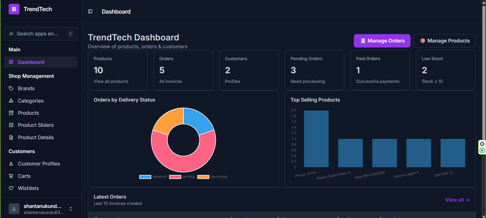
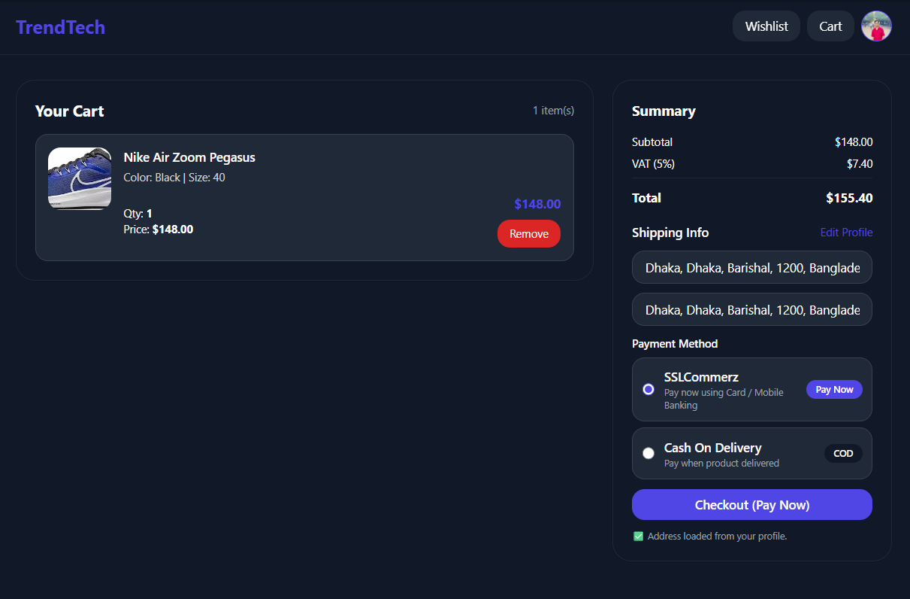
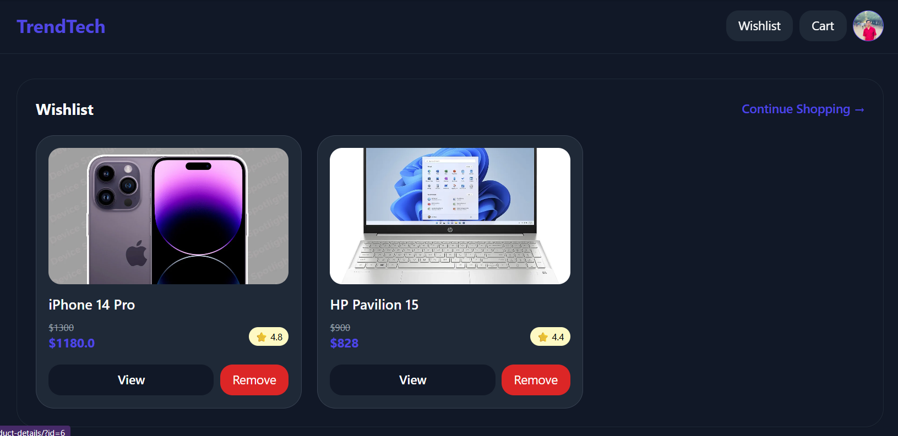
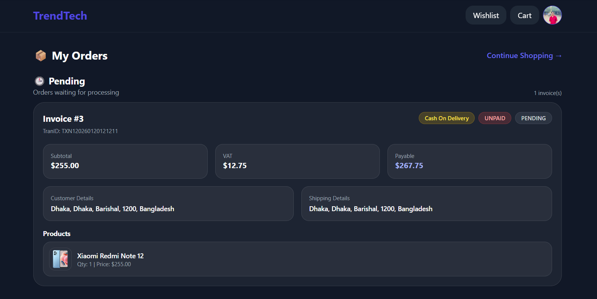
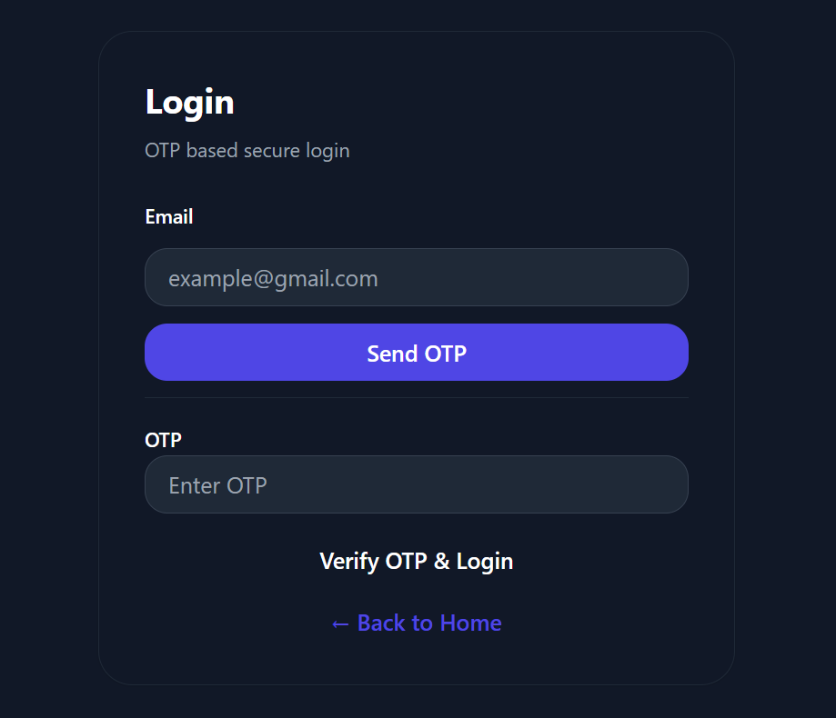

# TrendTech

Full-featured e-commerce backend using **Django** + **Django REST Framework (DRF)** with OTP authentication, JWT secured APIs, modern Unfold Admin Dashboard, and SSLCommerz/COD payment support.

---

## Overview

TrendTech is a full-featured e-commerce backend built using **Django** and **Django REST Framework (DRF)**.  
It includes OTP-based authentication, JWT secured APIs, cart & wishlist system, invoice management, and a modern **Unfold-powered Admin Dashboard** with charts and KPIs.

---

## Screenshots

### Admin Dashboard


### TrendTech Dashboard


### Product Management


### Product-Details Management


### Cart Management


### Wishlist Management


### Orders / Invoice Management


### OTP Login Flow


---

## Features

### Catalog & Product Management
- Brands & Categories management
- Product listing with:
  - price, discount, discount price
  - stock, star rating, remark tags (`popular`, `new`, `top`, `special`)
- Product slider support for homepage promotions
- Product details with:
  - multiple images
  - description, sizes, colors

### Customer & Shopping Flow
- Customer profile create/update
- Cart:
  - add / remove / list items
  - quantity management & total calculation
- Wishlist:
  - add / remove / list items
- Product reviews:
  - review allowed only for delivered products (verified buyer rule)

### Authentication (OTP + JWT)
- Email OTP login system
- OTP expiry handling
- OTP attempt limit protection
- JWT-based secured APIs

### Orders & Payments
- Invoice generation from cart items
- Payment support:
  - Cash On Delivery (COD)
  - SSLCommerz (sandbox-ready integration)
- Payment callbacks:
  - Success / Fail / Cancel / IPN

### Admin Dashboard (Django Unfold)
- Modern responsive admin UI
- Sidebar navigation
- KPI cards:
  - total products, orders, customers
  - pending orders, paid orders, low stock
- Charts:
  - delivery status pie chart
  - top selling products bar chart
- Latest orders table view

---

## Tech Stack

- **Backend:** Django, Django REST Framework (DRF)
- **Database:** SQLite (default for development)
- **Authentication:** OTP + JWT
- **Admin UI:** Django Unfold
- **Payment:** SSLCommerz (sandbox) + Cash On Delivery (COD)
- **Python:** 3.12+

---

## Project Structure

```text
TrendTech/
│
├── myapp/
│   ├── admin.py
│   ├── admin_site.py
│   ├── models.py
│   ├── serializers.py
│   ├── views.py
│   ├── urls.py
│   └── drf_auth.py
│
├── templates/
│   ├── admin/
│   │   └── index.html
│   └── unfold/
│       └── helpers/
│           └── theme_switch.html
│
├── static/
│   └── admin_custom.css
│
├── manage.py
├── requirements.txt
└── README.md
